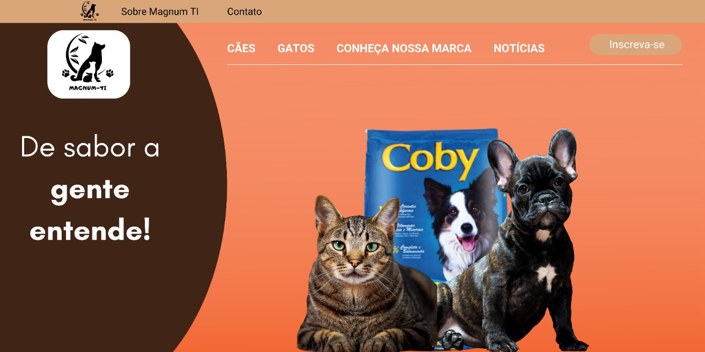

# Fábrica de Projetos II - Magnum TI

## Informações da Equipe 🏆: 

 Nossa equipe é formada por 5 integrantes: Antônio Reche, Guilherme Magarotti, João Gabriel Garcia, Marcus Vinicius Takeyasu e Rodrigo Lopes. Todos possuem suas funções específicas dentro da equipe e, a partir disso, conversamos diariamente, para nos informarmos a respeito do desenvolvimento e andamento do projeto, para que todas as datas possam ser cumpridas sem maiores problemas.

## Projeto 🛍️:

 Esse projeto teve como inspiração um E-Commerce, ou seja, um comércio eletrónico que exerce suas funcionalidades integralmente via meio digital. Com base nisso, utilizariamos essa interface, totalmente estilizada por nós, para divulgar nossos produtos e ganhar fama na área dos pets. A conclusão desse projeto está ligada à um dos requisitos para a conclusão do curso de Análise e Desenvolvimento de Sistemas, na Facens, destacando aqui nosso orientador para elaboração do projeto, Robson Martins. 

 

  

## Tecnologias / IDEs em Utilização 💻: 
<ul>
  <li>Java;</li>
  <li>Java Swing;</li>
  <li>Banco de Dados Relacional: MySQL;</li>
  <li>NetBeans.</li>
</ul>

## Instalação 🔌:
Clone esse projeto com o Git Bash, utilizando o comando abaixo:
        
       git clone https://github.com/guimagarotti/fabrica-II-magnumTI.git

## 🚀 Bora codar! 🚀
